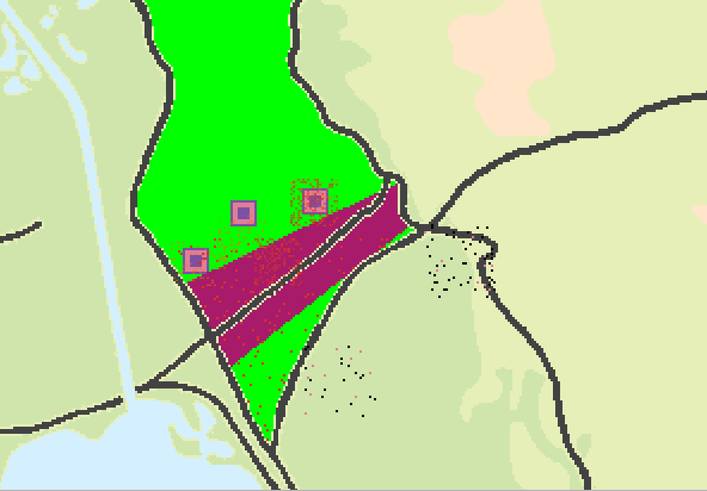

# Battle For The Chinese Farm Simulation

  
*Egyptian (green) vs Israeli (blue) forces in the Chinese Farm/Bridgehead sector*

## 📌 Overview
A NetLogo Q-learning simulation modeling the 1973 Yom Kippur War battlefield dynamics, focusing on:
- **Territorial control** (Bridgehead vs Chinese Farm)
- **Adaptive unit behaviors** using reinforcement learning
- **Attrition analysis** under different exploration strategies

## 🎯 Key Findings
| Metric                | Egyptian Optimal | Israeli Optimal |
|-----------------------|------------------|-----------------|
| Exploration Rate (ε)  | 0.3-0.5          | 0.5-0.7         |
| Bridgehead Control    | 11-14%           | 60-75%          |
| Tank Loss Ratio       | 1:1.4            | 1:0.7           |

**Critical Insight**: Moderate exploration (ε=0.4) preserves Egyptian forces while maintaining footholds.

## 🛠️ How It Works
### Core Mechanics
```netlogo
ask egyptian-tanks [
  ifelse random-float 1 < e-epsilon 
    [ explore-new-actions ]  ;; Random tactical variation
    [ execute-best-known-action ]  ;; Q-table driven
]
